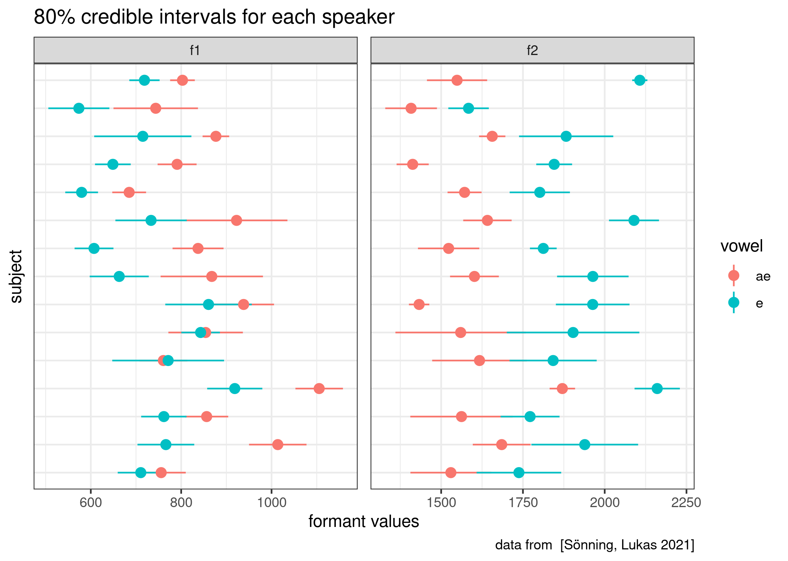

```{r, message=FALSE}
library(tidyverse)
theme_set(theme_bw())
knitr::opts_chunk$set(message = FALSE)
library(fitdistrplus)
library(lme4)
library(lmerTest)
```

## task 3.1 (вес задания: 3)

В датасет `vowel_data.csv` записаны значения формант гласных для носителей британского английского языка из исследования [Sönning, Lukas 2021]. Используя данные всех носителей, проведите эмпирическую байесовскую оценку, чтобы получить априорное распределение, сделайте байесовский апдейт всех носителей и постройте график 80% доверительных интервалов для каждого носителя. Какой носитель, согласно полученным доверительным интервалам, показывает самую невыразительную разницу между гласными?

```{r}
br_vowels <- read_csv("vowel_data.csv")

...

e_f1 <- fitdist(...)
e_f2 <- ...
ae_f1 <- ...
ae_f2 <- ...

e_f1$estimate %>% 
  bind_rows(e_f2$estimate,
            ae_f1$estimate,
            ae_f2$estimate) %>% 
  mutate(formant = c("f1", "f2", "f1", "f2"),
         vowel = c("e", "e", "ae", "ae")) %>% 
  rename(mean_prior = mean,
         sd_prior = sd) ->
  priors

br_vowels %>% 
  group_by(subject, vowel) %>% 
  summarise(...) %>% 
  pivot_longer(names_to = "type", values_to = "values", mean_f1:sd_f2) %>% 
  separate(type, into = c("type", "formant")) %>% 
  pivot_wider(values_from = values, names_from = "type") %>% 
  left_join(priors) %>% 
  rowwise() %>% 
  mutate(...) %>% 
  ggplot(aes(y = subject, 
             x = cred_int_mean, 
             xmin = cred_int_l_80, 
             xmax = cred_int_h_80, 
             color = vowel))+
  geom_pointrange()+
  facet_wrap(~formant, scales = "free")+
  labs(...)
```



Ответ: ...

## task 3.2 (вес задания: 3)

В датасет `norwegian_lexical_development.csv` записаны данные из исследования [Hansen 2017], посвященного усваиванию лексики носителями норвежского. В датасете собраны следующие переменные:

* `Word_NW` -- норвежские слова;
* `Translation` -- перевод норвежских слов на английский;
* `CDS_freq` -- усредненная частота слова в речи, адресованной детям;
* `AoA` -- усредненный возраст освоения слова (в месяцах);
* `Lex_cat` -- лексическая категория, приписанная исследователями.

Постройте и визуализируйте лучшую регрессию, которая предсказывает возраст усвоения слова в зависимости от частотности в речи, адресованной детям. Помните про необходимость преобразования переменных, чтобы связь была линейной. Сравните полученный результат с результатом работы функции `geom_smooth()`, которая генерирует отдельную независимую регрессию для каждой из групп.

```{r}
nld <- read_csv("norwegian_lexical_development.csv")
...
```


## task 3.3 (вес задания: 2)

Перед вами четыре графика остатков. Проанализируйте каждый из них и опишите нарушения ограничений на применение регрессии, которые вы можете увидеть.


### График 1
...

### График 2
...

### График 3
...

### График 4
...

## task 3.4 (вес задания: 1)

Место для рефлексии по поводу ответов. Заполняется после того, как присланы ответы на задания до 28.03.2021 23:59. Это оцениваемое задание.
